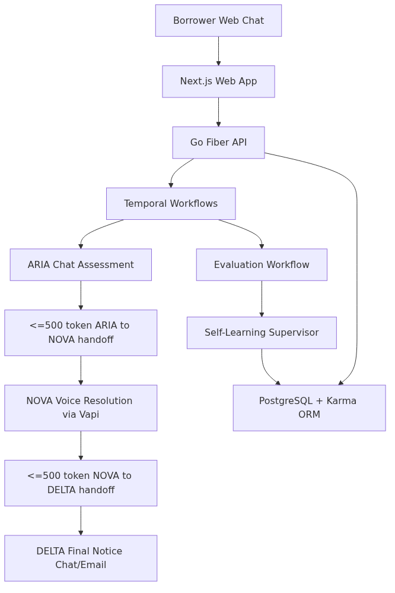
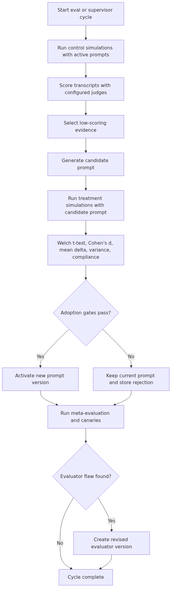

# Riverline Collections AI

Riverline Collections AI is a post-default debt collections system built for the Riverline self-learning agents assignment in [llm-docs/problem.md](llm-docs/problem.md). It presents one continuous borrower experience while a Temporal workflow coordinates three specialized agents:

- ARIA, a chat assessment agent that verifies identity and gathers facts.
- NOVA, a voice resolution agent powered through Vapi that presents policy-bounded repayment options.
- DELTA, a final-notice chat agent that records the last written offer and consequences.

The system also includes a simulation harness, quantitative LLM-as-judge evaluation, prompt experiment adoption gates, prompt/evaluator versioning, rollback, cost logging, and an always-on self-learning supervisor. The deeper explanation of the judges, meta-evaluator, and self-learning loop lives in [SELF_LEARNING.md](SELF_LEARNING.md).

## Architecture Diagram



## Assignment Mapping

| Requirement from problem.md                          | Implementation                                                                                                                                                                                         |
| ---------------------------------------------------- | ------------------------------------------------------------------------------------------------------------------------------------------------------------------------------------------------------ |
| Temporal workflow per borrower                       | `services/server/internal/workflows/borrower.go` orchestrates ARIA, NOVA, DELTA, and evaluation child workflows.                                                                                       |
| Two chat agents and one voice agent                  | ARIA and DELTA are chat agents; NOVA is a Vapi voice agent with a dry-run/synthetic fallback path.                                                                                                     |
| Continuous borrower experience                       | Handoffs are structured summaries, not raw transcript dumps, so each stage starts with the minimum facts needed to continue without repeated questions.                                                |
| 2000 token agent budget and 500 token handoff budget | Agent prompts reserve space for handoff context; handoff generators explicitly request `<= 500 token` runtime summaries.                                                                               |
| Quantitative self-learning loop                      | Simulation scores are aggregated across independent judges, compared with Welch's t-test and Cohen's d, and stored with raw score arrays.                                                              |
| Compliance preservation                              | Evaluator prompts, agent truth constraints, compliance canaries, and adoption gates prevent prompt updates that regress compliance.                                                                    |
| Audit trail and rollback                             | `prompt_versions`, `prompt_experiments`, `conversation_scores`, `evaluator_versions`, `meta_flags`, and rollback endpoints preserve the evolution history.                                             |
| Darwin Godel Machine style meta-evaluation           | `RunMetaEvaluation` detects evaluator flaws such as score inflation, useless metrics, judge disagreement, invalid judge output, and post-adoption regression, then creates a revised evaluator prompt. |
| Reproducibility                                      | `make eval` reruns the full cycle with seed/config and emits JSON artifacts; `make report` exports CSV reports.                                                                                        |
| Cost cap                                             | All LLM calls are logged in `llm_cost_log`; supervisor defaults to an incremental spend cap from `LEARNING_LOOP_BUDGET_USD` (default `15`).                                                            |

## Three-Agent Pipeline

| Agent | Modality           | Purpose                                                                                                                                                                      | Style                           |
| ----- | ------------------ | ---------------------------------------------------------------------------------------------------------------------------------------------------------------------------- | ------------------------------- |
| ARIA  | Chat               | Establish debt, verify identity with partial account information, collect employment/income/obligations/default reason, and decide whether a NOVA resolution call is viable. | Cold, clinical, fact-gathering. |
| NOVA  | Voice              | Generate and present exact policy-bounded settlement terms, including lump-sum, EMI, and hardship referral where allowed. Handles objections by restating terms.             | Transactional dealmaker.        |
| DELTA | Chat/email handoff | Produce a documented final offer, deadline, and consequence summary after NOVA fails to close or cannot connect.                                                             | Deadline-focused final notice.  |

The intended borrower progression is information, then transaction, then ultimatum. The workflow does not expose the internal agent boundary to the borrower.

## Cross-Modal Handoffs

Handoffs are generated as structured outputs in [services/server/internal/collections/handoff.go](services/server/internal/collections/handoff.go):

- `GenerateAriaHandoff` consumes ARIA chat messages, borrower data, and loan data. It stores assessment fields, `aria_summary`, `context_for_nova`, and the borrower-confirmed callback time.
- `GenerateNovaOffer` turns ARIA context and loan policy into exact commercial offer terms before the Vapi call.
- `GenerateNovaRuntimeContext` creates a plain-text `<=500 token` voice-call context containing only call-ready facts and offer terms.
- `GenerateNovaCallHandoff` parses the Vapi transcript or structured output into accepted/rejected status, objections, updated ARIA memory, and final-offer terms.
- `GenerateDeltaRuntimeContext` and `GenerateDeltaHandoff` produce the final written context and DELTA handoff summary.

This design preserves continuity while keeping each downstream agent under the context budget. The current enforcement is prompt/instruction based: the summarizers are explicitly instructed to stay under 500 tokens and cost/token usage is logged, but there is not yet a hard tokenizer truncation guard.

## Temporal Workflow

`AriaHandoffWorkflow` is the entry workflow. It completes ARIA, prepares NOVA, waits until the scheduled call time, starts the Vapi call, and starts `NovaCompletionWorkflow` as a child.

`NovaCompletionWorkflow` waits for either a Vapi webhook signal or polling fallback. Retryable call outcomes such as busy, no-answer, voicemail, and provider failure are retried up to `NovaMaxCallAttempts` with backoff. Once NOVA completes, the workflow starts `DeltaHandoffWorkflow`.

`DeltaHandoffWorkflow` sends either a NOVA agreement email or a DELTA final-offer email, then starts `EvaluationWorkflow`.

`EvaluationWorkflow` scores all workflow conversations and calls the production learning tick when scores are available.

Key implementation choices:

- Child workflows use `PARENT_CLOSE_POLICY_ABANDON` so a parent completion does not kill later-stage work.
- NOVA scheduling uses the `reschedule_nova_call` Temporal signal.
- NOVA completion uses the `nova_complete` signal plus polling fallback.
- Simulations force ARIA -> NOVA -> DELTA handoff coverage so evaluation sees the full system path even when a persona mentions stop-contact or hardship early.

## Self-Learning Flow Chart



See [SELF_LEARNING.md](SELF_LEARNING.md) for the detailed mechanics.

## Evaluation Method

Synthetic borrowers cover the assignment personas: cooperative, combative, evasive, confused, and distressed. A persona LLM chats against the current agent prompts and generates full-system transcripts. The scoring layer evaluates the transcript as a single borrower experience, not as isolated agent snippets.

The default judges are configured in [services/server/constants/eval_config.go](services/server/constants/eval_config.go):

- `judge_grok4_xai` using xAI Grok 4.
- `judge_grok4_fast_reasoning_xai` using xAI Grok 4 Fast Reasoning with slightly higher weight.

Judge configuration is overridable with `EVALUATOR_JUDGES_JSON`. The evaluator returns numeric dimensions for identity verification, completeness, redundancy, tone, offer clarity, objection handling, commitment attempt, context continuity, consequence accuracy, deadline specificity, negotiation drift, and compliance.

Prompt adoption is quantitative. The current demo defaults are:

| Gate                 | Default                                            |
| -------------------- | -------------------------------------------------- |
| Welch p-value        | `< 0.35`                                           |
| Cohen's d            | `>= 0.15`                                          |
| Mean score delta     | `>= 1.5`                                           |
| Treatment stddev     | `<= 25`                                            |
| Treatment compliance | `>= MinComplianceRate` and `>= control compliance` |

These thresholds are intentionally cheap/demo-friendly for a constrained assignment run. They are centralized in `DefaultSelfLearningConfig` and can be tightened for production or larger sample sizes.

## Meta-Evaluation

The meta-evaluator checks whether the evaluator itself has become unreliable. It can raise flags for:

- Score inflation: high, low-variance scores that stop discriminating.
- Metric uselessness: a metric with near-zero variance.
- Judge disagreement: judges diverging beyond `MaxJudgeDisagreement`.
- Invalid judge output: malformed or unusable JSON from judge calls.
- Post-adoption regression: a newer active prompt performing worse than the previous version.

When a flag is raised, the system stores the evidence in `meta_flags`, asks the prompt generator to revise the evaluator prompt while preserving the JSON schema, creates a new `evaluator_versions` row for the system evaluator, and marks the flag resolved.

Compliance canaries exercise the evaluator against known violations, including missing AI disclosure, false threats, harassment after stop-contact, misleading terms, hardship mishandling, missing logging/recording disclosure, unprofessional language, and privacy leaks.

## Running Locally

Prerequisites:

- Docker and Docker Compose.
- Bun 1.3.x for local package scripts.
- Go 1.22+ if running server commands outside Docker.
- LLM provider keys for agents, judges, and prompt generation.
- Vapi credentials for live NOVA calls, or `VAPI_DRY_RUN=true` for local dry-run behavior.

Setup:

```sh
cp .env.example .env
cp services/server/.env.example services/server/.env
cp apps/web/.env.local.example apps/web/.env.local
# Edit the env files with the provider keys and app credentials for your environment.
bun install
bun run dev
```

Development services:

| Service        | URL                           |
| -------------- | ----------------------------- |
| Web app        | `http://localhost:3000`       |
| Chat UI        | `http://localhost:3000/chat`  |
| Admin UI       | `http://localhost:3000/admin` |
| API            | `http://localhost:9000`       |
| Temporal UI    | `http://localhost:8080`       |
| Drizzle Studio | `http://localhost:4983`       |
| PostgreSQL     | `localhost:5433`              |

The backend calls `EnsureDefaults` during startup/evaluation flows to seed baseline prompts, evaluator versions, demo borrower data, and compliance canaries.

## Reproducibility

Run the complete evaluation cycle:

```sh
make eval SEED=42 BATCH_SIZE=2 AGENT=all OUTPUT=./eval-artifacts
```

This runs seeded simulations, scoring, prompt generation, treatment comparison, meta-evaluation, canaries, and artifact export.

Generate CSV reports from database state:

```sh
make report OUTPUT=./eval-artifacts
```

The `cmd/eval` output directory includes JSON artifacts such as:

| File                       | Contents                                               |
| -------------------------- | ------------------------------------------------------ |
| `full_report.json`         | Full nested cycle report.                              |
| `run_config.json`          | Seed, agents, personas, batch size, and timestamps.    |
| `conversation_scores.json` | Per-conversation scores and judge details.             |
| `prompt_experiments.json`  | Control/treatment score arrays and adoption decisions. |
| `meta_flags.json`          | Meta-evaluation flags and evidence.                    |
| `evaluator_versions.json`  | Evaluator prompt history.                              |
| `canary_results.json`      | Canary test results.                                   |
| `llm_cost_log.json`        | Per-call cost records.                                 |
| `prompt_versions.json`     | Agent prompt version history.                          |

## API Surface

Routes are mounted under `/api/v1`. Borrower routes require Clerk auth; admin routes also require the user to be marked admin.

Borrower-facing:

- `POST /api/v1/workflows/start`
- `GET /api/v1/workflows/:id`
- `POST /api/v1/chat/:workflowId`
- `GET /api/v1/chat/:workflowId/stream`
- `GET /api/v1/conversations/:id`
- `GET /api/v1/workflows/:workflowId/delta-handoff`
- `GET /api/v1/workflows/:workflowId/delta-handoff.pdf`

Webhooks:

- `POST /api/v1/vapi/webhook`

Admin and evaluation:

- `GET /api/v1/admin/eval`
- `GET /api/v1/admin/eval/metrics`
- `GET /api/v1/admin/eval/meta`
- `GET /api/v1/admin/eval/experiments/:id`
- `POST /api/v1/admin/simulations`
- `POST /api/v1/admin/simulations/single`
- `POST /api/v1/admin/prompt-experiments`
- `POST /api/v1/admin/eval/full-cycle`
- `POST /api/v1/admin/eval/full-cycle/start`
- `GET /api/v1/admin/eval/runs/:id`
- `POST /api/v1/admin/evaluations/rerun`
- `POST /api/v1/admin/prompt-versions/rollback`
- `POST /api/v1/admin/meta-evaluations`
- `POST /api/v1/admin/learning/start`
- `POST /api/v1/admin/learning/stop`
- `GET /api/v1/admin/learning/status`
- `POST /api/v1/admin/eval/reset`
- `GET /api/v1/admin/eval/export/scores`
- `GET /api/v1/admin/eval/export/experiments`

Single simulation smoke test:

```sh
curl -X POST "$URL/api/v1/admin/simulations/single" \
  -H "Authorization: Bearer $TOKEN" \
  -H "Content-Type: application/json" \
  -d '{"persona":"cooperative","seed":42,"max_turns_per_agent":6}'
```

Start the continuous learning supervisor:

```sh
curl -X POST "$URL/api/v1/admin/learning/start" \
  -H "Authorization: Bearer $TOKEN" \
  -H "Content-Type: application/json" \
  -d '{"max_incremental_cost_usd":15,"prompt_gen_every_n_scores":3,"meta_eval_every_n_judges":4}'
```

## Database Tables

Database migrations are defined with Drizzle in [database/schema.ts](database/schema.ts). The Go server uses Karma ORM models in `services/server/internal/models`.

Important tables:

| Table                 | Purpose                                                                        |
| --------------------- | ------------------------------------------------------------------------------ |
| `users`               | Borrower profiles and admin flag.                                              |
| `loans`               | Loan facts, outstanding amount, account suffix, policy discount, overdue days. |
| `borrower_workflows`  | Workflow state and handoff context fields.                                     |
| `resolution_offers`   | NOVA offer terms, call status, acceptance, objections.                         |
| `agent_conversations` | Conversation metadata per agent and workflow.                                  |
| `agent_messages`      | Individual borrower/agent messages.                                            |
| `prompt_versions`     | Versioned ARIA/NOVA/DELTA prompts.                                             |
| `conversation_scores` | Per-conversation/system evaluation results.                                    |
| `prompt_experiments`  | Control/treatment comparison records.                                          |
| `evaluator_versions`  | Versioned judge prompts.                                                       |
| `meta_flags`          | Evaluator flaw flags and resolutions.                                          |
| `compliance_canaries` | Known compliance-violation test cases.                                         |
| `canary_results`      | Canary execution results.                                                      |
| `llm_cost_log`        | Per-call cost and token accounting.                                            |

## Project Structure

```text
riverline.assessment/
|-- apps/web/                    # Next.js frontend
|-- database/                    # Drizzle schema and migrations
|-- llm-docs/                    # Assignment, rules, ORM docs, implementation notes
|-- services/server/
|   |-- cmd/
|   |   |-- eval/                # Reproducible evaluation CLI
|   |   |-- report/              # CSV report generator
|   |   |-- worker/              # Temporal worker
|   |   `-- aiprobe/             # Provider probe utility
|   |-- constants/               # Seed prompts, agent truth, evaluator config
|   `-- internal/
|       |-- agents/              # Agent clients and prompt loading
|       |-- collections/         # Business logic, handoffs, cost logging
|       |-- eval/                # Simulation, judges, experiments, meta-eval, supervisor
|       |-- handlers/            # HTTP handlers
|       |-- routes/              # Fiber route registration
|       |-- vapi/                # Vapi client
|       `-- workflows/           # Temporal workflows and activities
|-- docker-compose.yml
|-- Makefile
`-- SELF_LEARNING.md
```

## Limitations

- Handoff token budgets are instruction-enforced today. A production version should add tokenizer-based hard truncation and rejection.
- Demo statistical thresholds are intentionally permissive to fit a small, low-cost assignment run. Production should require larger samples and stricter significance.
- The learning loop evaluates through simulations and post-run scoring. It does not run live traffic A/B splits.
- NOVA depends on Vapi for real calls. Dry-run/synthetic behavior keeps local flows testable without a live phone call.
- The supervisor status is in-memory and process-bounded. Restarting the backend loses the active supervisor state, though persisted scores, prompts, costs, and experiments remain.
- The assignment requires a handwritten decision journal, an audio recording, and a short demo video. Those are submission artifacts outside the generated code/docs.
